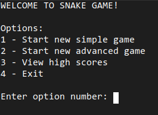
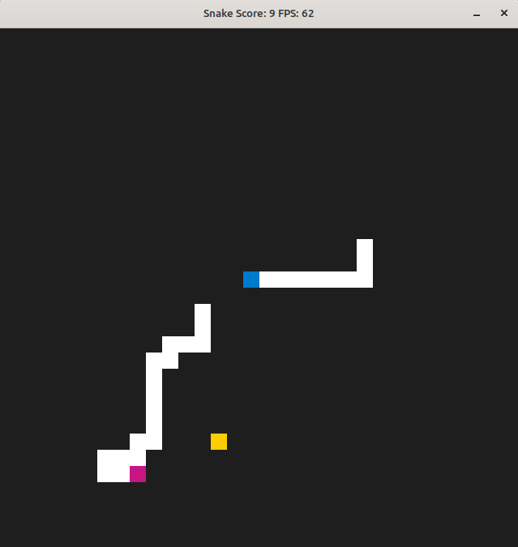
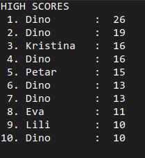

# CPPND: Capstone Snake Game

This game was developed from a starter repo for the Capstone project in the [Udacity C++ Nanodegree Program](https://www.udacity.com/course/c-plus-plus-nanodegree--nd213). The code for this repo was inspired by [this](https://codereview.stackexchange.com/questions/212296/snake-game-in-c-with-sdl) excellent StackOverflow post and set of responses.

 

Basic game functionality has been extended as follows:

* The actual game is wrapped in a _menu loop_. Upon running the executable, a menu is shown in the terminal. The user then selects the desired menu option.

 

* Existing game mode (i.e. one blue-headed user-controlled snake) is deemed as Simple game mode. Now there is also an Advanced game mode, where the user-controlled snake and one magenta-headed autonomous snake go after the same food. The autonomous snake is driven using the A* algorithm, and avoids moving over board edges.

 

* The game keeps track of top 10 high scores regardless of game mode (i.e. both modes share the same high score data).

 

## Dependencies for Running Locally
* cmake >= 3.7
  * All OSes: [click here for installation instructions](https://cmake.org/install/)
* make >= 4.1 (Linux, Mac), 3.81 (Windows)
  * Linux: make is installed by default on most Linux distros
  * Mac: [install Xcode command line tools to get make](https://developer.apple.com/xcode/features/)
  * Windows: [Click here for installation instructions](http://gnuwin32.sourceforge.net/packages/make.htm)
* SDL2 >= 2.0
  * All installation instructions can be found [here](https://wiki.libsdl.org/Installation)
  >Note that for Linux, an `apt` or `apt-get` installation is preferred to building from source. 
* gcc/g++ >= 5.4
  * Linux: gcc / g++ is installed by default on most Linux distros
  * Mac: same deal as make - [install Xcode command line tools](https://developer.apple.com/xcode/features/)
  * Windows: recommend using [MinGW](http://www.mingw.org/)

## Basic Build Instructions

1. Clone this repo.
2. Make a build directory in the top level directory: `mkdir build && cd build`
3. Compile: `cmake .. && make`
4. Run it: `./SnakeGame`.

## Program code highlights

This project uses multiple modern C++ features and paradigms:

* [Reading](src/highscore.cpp#L74) and [writing](src/highscore.cpp#L56) data from an external file.
* Using data structures such as [arrays](src/game.cpp#L258) and [vectors](src/highscore.h#L27), as well as [constant variables](src/constants.h#L17) and [constant function parameters](src/location.h#L10).
* [Function overloading](src/renderer.h#L13) with different signatures for the same function name.
* [Inheritance hierarchies](src/game.h#L42) with [virtual base class member function overriding](src/game.h#L45).
* [Function templates](src/menu.h#L9).
* Passing variables by references ([example 1](src/location.h#L10), [example2](src/menu.cpp#L17)).
* [Freeing up](src/renderer.cpp#L39) unmanaged dynamically allocated memory using a destructor.
* [Using std::move](src/highscore.cpp#L78) as one aspect of move semantics.
* [Smart pointers](src/menu.cpp#L20) and [RAII](src/menu.cpp#L20) (Resource Acquisition Is Initialization) pattern.
* [Multithreading](src/menu.cpp#L29).
* [Promise/future](src/menu.cpp#L28) pattern.

## CC Attribution-ShareAlike 4.0 International

Shield: [![CC BY-SA 4.0][cc-by-sa-shield]][cc-by-sa]

This work is licensed under a
[Creative Commons Attribution-ShareAlike 4.0 International License][cc-by-sa].

[![CC BY-SA 4.0][cc-by-sa-image]][cc-by-sa]

[cc-by-sa]: http://creativecommons.org/licenses/by-sa/4.0/
[cc-by-sa-image]: https://licensebuttons.net/l/by-sa/4.0/88x31.png
[cc-by-sa-shield]: https://img.shields.io/badge/License-CC%20BY--SA%204.0-lightgrey.svg
